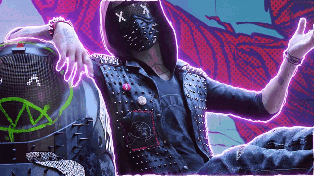

  Hola, soy Kento. Actualmente me dedico a la Programacion y Seguridad Informatica. 
  <code>Developer: Python, JS/TS, Java, Kotlin, ASP.NET 5/6, C#, C++ & PHP</code> 
  <code>Learning: Elixir, Rust & Ruby </code> 

 ---

  
  

 ---
 
 

  
  

 ---

  
  

